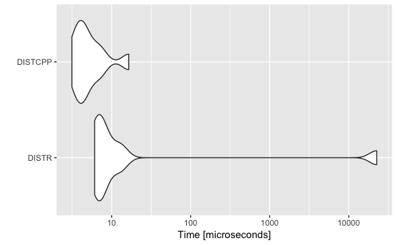

# `swatanomaly`

Various algorithms for anomaly detection

  - NND: Yun et al. (2018)
      - used in Cho et al. (2019), (*not this package*)

## Installation

``` r
devtools::install_github("ygeunkim/swatanomaly")
```

``` r
library(swatanomaly)
```

## Benchmark

### Euclidean Distance

``` r
set.seed(1)
x1 <- matrix(rnorm(100), nrow = 10)
x2 <- matrix(rnorm(100), nrow = 10)
```

``` r
euclidean_distance <- function(x, y) {
  sum(sqrt(colSums((x - y)^2)))
}
```

Using `swatanomaly::euc_dist(x, y)`, we try to compute

  
^2}")  

``` r
euclidean_distance(x1, x2)
#> [1] 40.6
euc_dist(x1, x2)
#> [1] 40.6
```

``` r
ggplot2::autoplot(
    microbenchmark::microbenchmark(
      DISTR = euclidean_distance(x1, x2),
      DISTCPP = euc_dist(x1, x2),
      times = 10
  )
)
```



It is obvious that `Rcpp` is faster than `R` solution.

-----

# References

<div id="refs" class="references">

<div id="ref-Cho:2019ji">

Cho, Jinwoo, Shahroz Tariq, Sangyup Lee, Young Geun Kim, and Simon Woo.
2019. “Contextual Anomaly Detection by Correlated Probability
Distributions using Kullback-Leibler Divergence.” *WORKSHOP ON MINING
AND LEARNING FROM TIME SERIES*.

</div>

<div id="ref-Yun:2018di">

Yun, Jeong-Han, Yoonho Hwang, Woomyo Lee, Hee-Kap Ahn, and Sin-Kyu Kim.
2018. “Statistical Similarity of Critical Infrastructure Network Traffic
Based on Nearest Neighbor Distances.” In *Research in Attacks,
Intrusions, and Defenses*, 1–23. Cham: Springer International
Publishing.

</div>

</div>
